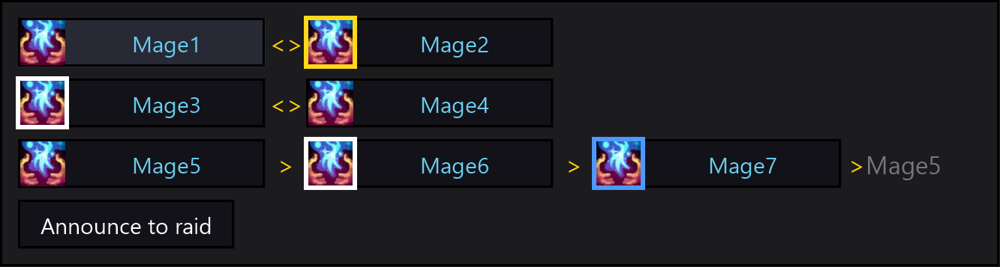

For mages: who trades **Focus Magic** with whom, so nobody has to sort it out in raid chat.

Every mage in your group is put into a trade:

- **Pairs** wherever possible - the two mages cast Focus Magic on each other.
- With an odd number of mages the last three form a **ring**: A gives to B, B to C, C back to A.
  Pairs come first, so 5 mages are one pair and one ring, 7 mages are two pairs and one ring.

The order is built from the mage names alphabetically, so **every mage running the addon sees exactly the
same plan** - nobody has to agree on anything first, and nobody ends up buffing the same person twice.

## Reading it

One row per trade, one block per mage. The border around an icon is the whole status:

| Border | What it means |
|---|---|
| yellow | the mage the plan gave you, and *your* Focus Magic is not on them |
| white | that mage has no Focus Magic at all - somebody else's job |
| blue | they have one, but from a mage the plan did not name |
| none | the plan is being followed |

Blue needs the caster to be visible to your client: a Focus Magic from somebody far away reads as unknown,
not as wrong, and draws no border. Your own block is a shade lighter than the rest.

## Using it

- **Click a name** to whisper that mage the order. The polite ask goes out at most once every 10 minutes
  per player, the order itself at most once every 10 seconds.
- **Click an icon** to cast Focus Magic on that mage - no targeting needed. Casting is protected by the
  game, so an icon can only be re-aimed out of combat: it keeps the aim it had when the fight started
  until the fight ends.
- **Announce to raid** posts the whole plan in raid (or party) chat:
  `Focus Magic order: Aaa <> Bbb | Ccc > Ddd > Eee > Ccc`. It has its own 10 second cooldown.
- The **button** carries the yellow border too, so a Focus Magic you owe is visible with the panel closed.
- Opened unlocked with nobody to show, the panel fills itself with seven stand-in mages, so you can size
  it and place the button before the raid starts. The stand-ins do nothing at all.

## How to install

1. Download the addon: **[MageFocusMagic-master.zip](https://github.com/arkrosclou/MageFocusMagic/archive/refs/heads/master.zip)**.
2. Open the zip. Inside is a folder called `MageFocusMagic-master`. Copy it into your addons folder
   (`Interface/AddOns`) and **rename it to `MageFocusMagic`**. With the `-master` ending the game will not
   load it.
3. Start the game. At the character selection screen, click **AddOns** (bottom left) and make sure
   **MageFocusMagic** is enabled.

## How to update

Download the zip again and replace the `MageFocusMagic` folder with the new one. Your settings are kept:
they live in the `WTF` folder, not in the addon.

## Options

Right-click the button, or type `/mfm`: the size of the button, the height of a row in the panel, which
way the panel opens from the button, and whether the button is locked in place.

| Command | What it does |
|---|---|
| `/mfm` | open the options |
| `/mfm toggle` | open / close the panel (for a macro) |
| `/mfm lock`, `/mfm unlock` | lock the button in place, or let it be dragged |
| `/mfm reset` | move the button back to the center |
| `/mfm plan` | print the current plan to your own chat |

The addon does nothing on other classes.

## Problems

Found a bug or got a Lua error? Please [open an issue](https://github.com/arkrosclou/MageFocusMagic/issues).
